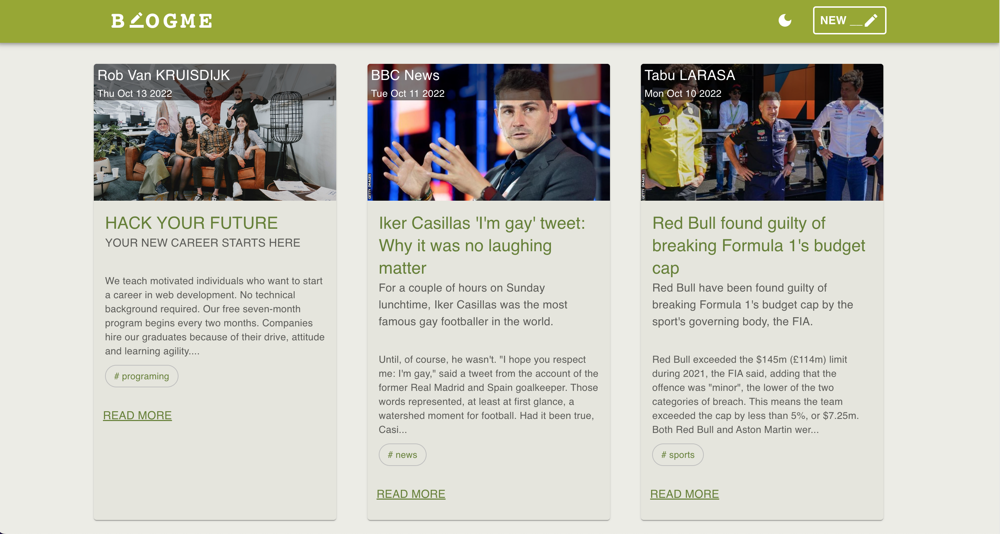
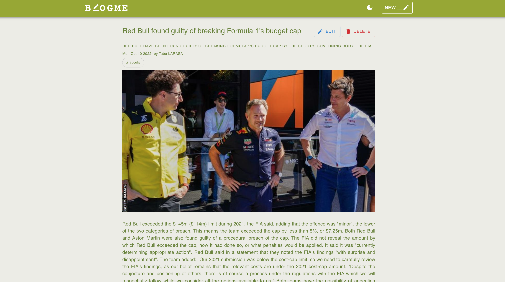
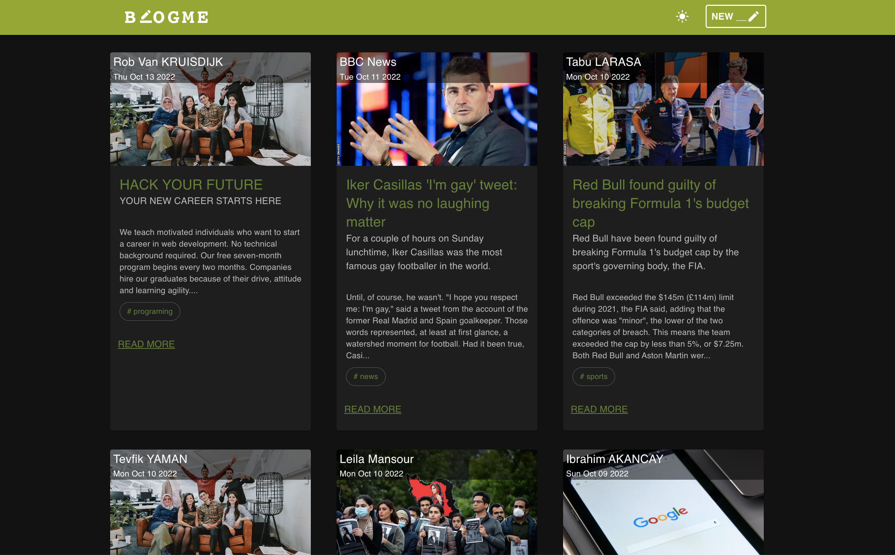
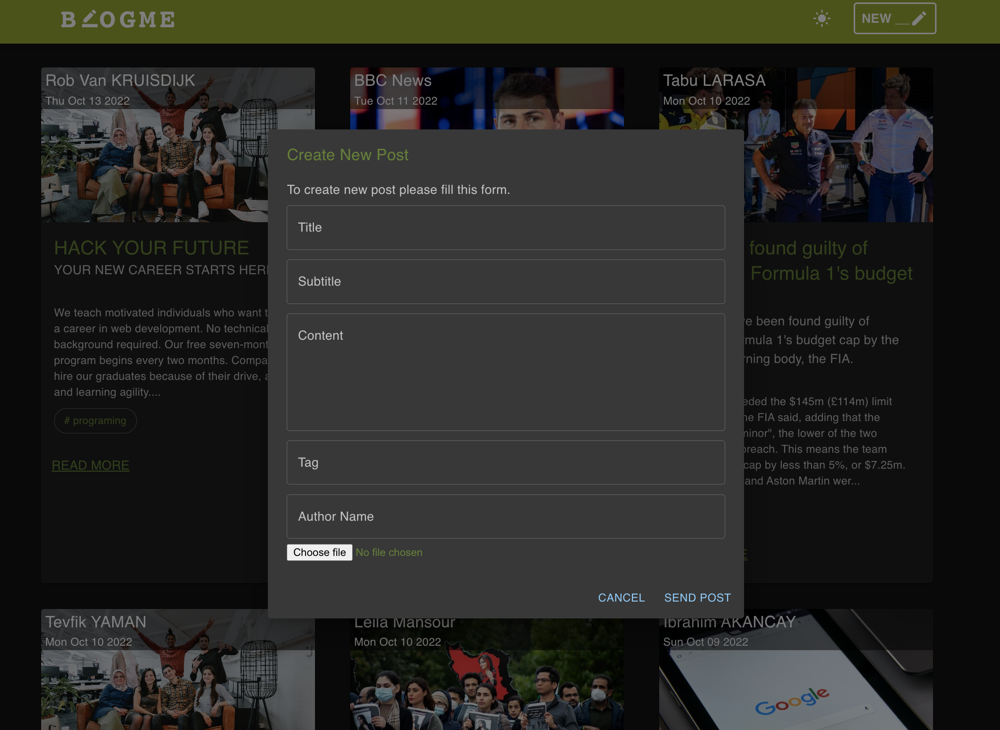

# BLOGME Mern Application
Project link is available [BLOGME](https://main--stately-cucurucho-46f72c.netlify.app/posts/63456daebdead82b14ac1c15)
 
 ## Home Page
 

 ## Post Detail Page
 

 ## Dark Mode
 

 ## Post Form
 

## Packages and Libraries
 ### Client Side
  - React
  - Material UI (for ui design)
  - Yup and react-hook-form (for form validation)
  - FileBase64 (for uploading file)
  - react-router-dom@v6 (for routing)

 ### Server Side
   - Express
   - cors
   - mongoose
   
## File Structure
```
Client
 ┃
📦src
 ┣ 📂assets
 ┃ ┣ 📜dark_mode.png
 ┃ ┣ 📜default.jpeg
 ┃ ┣ 📜form.png
 ┃ ┣ 📜home.png
 ┃ ┗ 📜post_detail.png
 ┣ 📂components
 ┃ ┣ 📜EditForm.js
 ┃ ┣ 📜Navbar.js
 ┃ ┣ 📜NewPostButton.js
 ┃ ┣ 📜PostCard.js
 ┃ ┣ 📜PostForm.js
 ┃ ┗ 📜ThemeSwitch.js
 ┣ 📂contexts
 ┃ ┣ 📜PostsProvider.js
 ┃ ┗ 📜ThemeProvider.js
 ┣ 📂helpers
 ┃ ┗ 📜timeMeasure.js
 ┣ 📂views
 ┃ ┣ 📜PostDetail.js
 ┃ ┗ 📜PostsPage.js
 ┣ 📜App.css
 ┣ 📜App.js
 ┣ 📜index.css
 ┗ 📜index.js

 
 📦 Server
 ┣ 📂controllers
 ┃ ┗ 📜posts.js
 ┣ 📂models
 ┃ ┗ 📜posts.js
 ┣ 📂routes
 ┃ ┗ 📜posts.js
 ┗ 📜index.js
 ```


